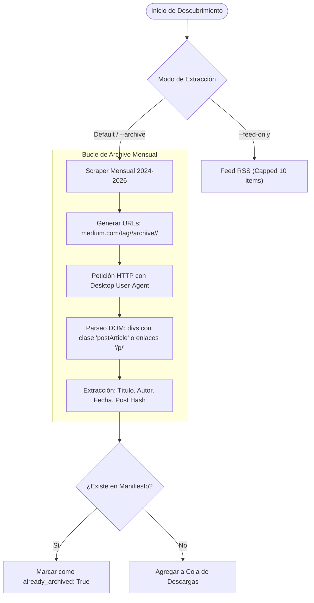
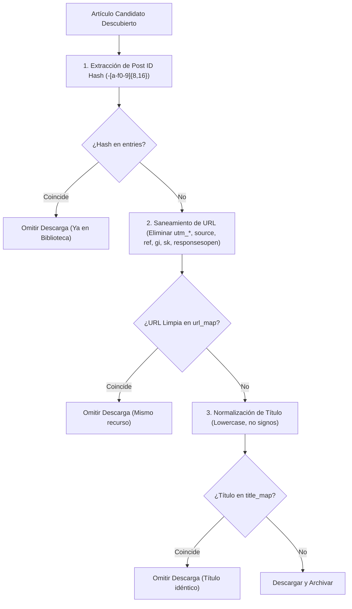

# 📖 Especificación Técnica y Arquitectura del Sistema (Medium-Vault)

> **Documento de Ingeniería y Manual de Arquitectura Interna**  
> Proyecto: `medium-vault` (`medium_archiver` & `medium-knowledge-base` MCP Server)  
> Fecha de actualización: 20 de Septiembre de 2026

---

## 1. Visión General del Sistema

El ecosistema **Medium Knowledge Base** está compuesto por tres subsistemas principales que operan de forma coordinada:

```
                                  ┌────────────────────────┐
                                  │      Medium.com /      │
                                  │  Freedium Mirror CFD   │
                                  └───────────┬────────────┘
                                              │ HTTP / Scraping
                                              ▼
┌───────────────────────┐         ┌────────────────────────┐
│ Agentes de IA / LLMs  │         │   Motor de Archivo     │
│ (Claude Code, Oz,     │◄───────►│  (medium_archiver.py)  │
│ Antigravity, Cursor)  │         │                        │
└───────────┬───────────┘         └───────────┬────────────┘
            │ stdio / JSON-RPC                │ I/O Local
            ▼                                 ▼
┌───────────────────────┐         ┌────────────────────────┐
│  Servidor MCP stdio   │◄───────►│    Base Offline de     │
│      (server.py)      │         │   Conocimiento (.md)   │
└───────────────────────┘         └────────────────────────┘
```

1. **Motor de Descubrimiento y Extracción (`medium_archiver.py`):**
   - Rastreo mensual de archivos estáticos (2024–2026).
   - Deduplicación previa a la red en 3 niveles.
   - Saneamiento del DOM, filtrado de ruido, descarga concurrente de imágenes en alta resolución.
   - Generación de Markdown estructurado con YAML frontmatter.
2. **Motor de Auditoría y Control de Calidad (`--audit` / `--clean-markdown`):**
   - Eliminación de bloques de código Shiki duplicados generados por temas oscuros/claros simultáneos.
   - Reversión determinista de Mojibake UTF-8 (corrupciones de `ISO-8859-1`).
   - Clasificación sintáctica de bloques de código (`bash`, `http`, `json`, `sql`, `javascript`, `python`, `text`).
3. **Capa de Exposición Multi-Harness (`server.py` & `SKILL.md`):**
   - Servidor MCP basado en el estándar `stdio` compatible con cualquier harness o IDE moderno.
   - Acceso sin latencia de red a miles de artículos técnicos, tutoriales, documentación y recursos con imágenes HD offline.

---

## 2. Subsistema de Descubrimiento de Archivos

### 2.1 Limitación de los Feeds RSS y Solución Recursiva
Medium limita sus feeds RSS (`https://medium.com/feed/tag/<topic>`) a un máximo de **10 artículos recientes**, lo que impide construir una base de conocimiento histórica.

Para superar esto, `MediumFeedDiscoverer` implementa un algoritmo de doble fase:



### 2.2 Normalización de Tópicos y Alias Multidominio
`MediumFeedDiscoverer.resolve_topic_candidates()` implementa un catálogo de alias multidominio para mapear términos coloquiales y siglas a sus tags oficiales en Medium:

- **Inteligencia Artificial y ML:** `ai` $\to$ `artificial-intelligence`, `ml` $\to$ `machine-learning`, `llm` $\to$ `large-language-models`
- **Desarrollo y Programación:** `js` $\to$ `javascript`, `ts` $\to$ `typescript`, `py` $\to$ `python`, `k8s` $\to$ `kubernetes`
- **Ciberseguridad e Infraestructura:** `ssrf` $\to$ `server-side-request-forgery`, `idor` $\to$ `insecure-direct-object-reference`, `rce` $\to$ `remote-code-execution`

---

## 3. Motor de Deduplicación en 3 Niveles

Para garantizar que un artículo no se descargue dos veces (incluso si se indexa en múltiples categorías o con parámetros de campaña disímiles), `LibraryManager` mantiene un índice en memoria sincronizado con `.library_manifest.json`:



### Estructura de Registro en `.library_manifest.json`

```json
{
  "title": "AI Didn’t Kill Manual Testing. Triage Bills Did.",
  "author": "Raj Namdev",
  "published": "2026-09-19",
  "source_url": "https://rajnamdev.medium.com/ai-didnt-kill-manual-testing-triage-bills-did-6059344032d4",
  "clean_url": "https://rajnamdev.medium.com/ai-didnt-kill-manual-testing-triage-bills-did-6059344032d4",
  "post_hash": "6059344032d4",
  "topic": "bug-bounty",
  "folder_rel_path": "bug-bounty/AI Didn’t Kill Manual Testing. Triage Bills Did",
  "retrieved_at": "2026-09-19T05:25:13Z",
  "file_size_kb": 11.95,
  "images_count": 1
}
```

---

## 4. Pipeline de Saneamiento y Calidad Markdown

El procesamiento del contenido convierte el HTML sucio en Markdown compatible con LLMs mediante 5 etapas consecutivas:

```
[HTML Crudo] ──► (1. Forzar UTF-8)
             ──► (2. Descomponer Shiki Dark & UI Residual)
             ──► (3. Descargar Imágenes HD a ./images/)
             ──► (4. Conversión DOM a GFM vía markdownify)
             ──► (5. Post-Procesamiento: Mojibake + Deduplicación + Sintaxis) ──► [article.md]
```

### 4.1 Reversión de Mojibake UTF-8
Cuando los mirrors web no envían el parámetro `charset=utf-8` en la cabecera `Content-Type`, las bibliotecas HTTP asumen `ISO-8859-1` según la RFC 2616. Esto provoca que los bytes UTF-8 se decodifiquen erróneamente en secuencias de caracteres Latin-1.

La función `fix_mojibake(text)` utiliza la siguiente heurística de expresiones regulares:
```python
pattern = re.compile(r'[\xc2-\xf4][\x80-\xbf]{1,3}')
```
Al encontrar secuencias de 2 a 4 bytes que corresponden exactamente a patrones UTF-8 válidos decodificados como Latin-1, invoca `raw.encode('latin1').decode('utf-8')`.

### 4.2 Deduplicación de Bloques de Código Consecutivos
El resaltador de sintaxis Shiki genera dos bloques `<pre>` paralelos para soportar modo oscuro y claro dinámico en CSS:
- `<pre class="shiki github-light">`
- `<pre class="shiki github-dark">`

El motor de saneamiento elimina de raíz cualquier nodo con clases `github-dark` o `dark:block`. Adicionalmente, `clean_markdown_document()` realiza un barrido por líneas: si dos bloques contiguos de código delimitados por triple comilla invertida (` ``` `) poseen contenido idéntico (ignorando espacios en blanco intermedios), el segundo se suprime por completo.

### 4.3 Clasificación Inteligente de Sintaxis
Para evitar que comandos de terminal o peticiones HTTP se marquen erróneamente como Python:
- **`bash`:** Detecta comandos (`curl`, `git`, `docker`, `subfinder`, `nuclei`, `httpx`, `ffuf`, `dirsearch`, `sqlmap`, `chmod`, `export`, etc.), `#!/bin/bash` o prefijos de prompt (`$ `, `# `).
- **`http`:** Detecta métodos HTTP (`GET /`, `POST /`, `PUT /`, etc.) o cabeceras de respuesta (`HTTP/1.1`, `HTTP/2`).
- **`json`:** Valida sintaxis JSON balanceada (`{...}` o `[...]`).
- **`sql`:** Detecta sentencias SQL (`SELECT`, `UNION SELECT`, `INSERT INTO`, etc.).
- **`javascript`:** Detecta funciones flecha, `console.log`, `document.getElementById`, `fetch(`, `require(`.
- **`python`:** Detecta `import`, `def ...:`, `class ...:`, `if __name__ == '__main__':`.
- **`text`:** Texto sin adornos sintácticos engañosos para salidas de terminal, tablas o diagramas ASCII.

---

## 5. Resiliencia de Red y Concurrencia

### 5.1 Rotación de Espejos y Circuit Breaker
En `WebReaderClient`:
- Mantiene una lista rotativa de espejos configurables (`DEFAULT_READERS`).
- Si un mirror responde con HTTP 502, 503, 504 o experimenta un fallo de resolución DNS (`NameResolutionError`), se activa un **Circuit Breaker** que marca el dominio como no saludable durante 120 a 600 segundos, redirigiendo el tráfico a los mirrors restantes o a Medium directo.
- Las solicitudes fallidas se reintentan con **Backoff Exponencial con Jitter**:
  $$\text{delay} = 1.2^{\text{attempt}} + \text{random}(0.1, 0.3)$$

### 5.2 Manejador de Estado Persistente (`DownloadStateManager`)
Durante descargas masivas concurrentes, se genera un archivo `.download_state.json` en la carpeta del tópico:
- Registra el total de artículos planificados, completados y pendientes.
- Si el proceso se interrumpe (interrupción voluntaria o fallo de red), al relanzar el comando con el mismo tag el sistema detecta la sesión inconclusa y reanuda inmediatamente el trabajo pendiente sin volver a descargar los artículos ya finalizados.

---

## 6. Servidor MCP (`server.py`) y Transporte `stdio`

El servidor implementa el protocolo MCP estándar para dotar a los agentes de capacidades offline:

### Esquema de Herramientas

```json
{
  "tools": [
    {
      "name": "medium_search_articles",
      "description": "Busca artículos técnicos y publicaciones offline por término clave, tópico o autor.",
      "parameters": {
        "query": {"type": "string", "description": "Término de búsqueda"},
        "topic": {"type": "string", "description": "Filtrar por tópico opcional"},
        "limit": {"type": "integer", "default": 10}
      }
    },
    {
      "name": "medium_get_article",
      "description": "Recupera el texto Markdown completo y metadatos de un artículo.",
      "parameters": {
        "identifier": {"type": "string", "description": "Hash del post, título o ruta"}
      }
    },
    {
      "name": "medium_get_stats",
      "description": "Devuelve estadísticas globales de la biblioteca."
    },
    {
      "name": "medium_archive_url",
      "description": "Descarga y procesa una URL de Medium bajo demanda."
    },
    {
      "name": "medium_export_archive",
      "description": "Genera un archivo zip comprimido (/archivefile)."
    }
  ]
}
```

---

## 7. Mapeo de Arquitectura y Grafo de Conocimiento (Graphify)

El repositorio se encuentra indexado en `graphify-out/`:

- **Hubs de Comunidad:**
  - `LibraryManager`: 16 aristas (Nodo central de indexación y deduplicación).
  - `DownloadStateManager`: 13 aristas (Gestión de estado y checkpointing).
  - `MediumFeedDiscoverer`: 12 aristas (Rastreo RSS y scraping mensual).
  - `WebReaderClient`: 10 aristas (HTTP, rotación de mirrors y circuit breakers).
  - `DOMSanitizerAndAssetBundler`: 8 aristas (Saneamiento DOM, bundling de imágenes HD).
  - `clean_markdown_document`: Nodo núcleo de calidad, mojibake e inferencia sintáctica.
- **Visualizaciones Disponibles:**
  - `graph.html`: Grafo de fuerzas interactivo D3.
  - `GRAPH_TREE.html`: Árbol colapsable por jerarquías de componentes.
  - `mediumm-callflow.html`: Secuencias de llamadas e invocaciones entre clases.
  - `GRAPH_REPORT.md`: Auditoría de acoplamiento y god-nodes.

---

## 8. Arquitectura de Seguridad y Modelo de Hardening

A raíz de la auditoría de seguridad realizada con el estándar **Cloudflare Security Audit Skill** (`security-audit-skill`), el sistema implementa un modelo de confianza cero para todas las entradas provistas por clientes MCP, agentes de IA y contenido remoto.

### 8.1 Modelo de Amenazas en Entornos Agénticos
En despliegues con LLMs (Claude Code, Cursor, Antigravity), el servidor MCP `server.py` recibe argumentos formulados por modelos que podrían ser manipulados mediante inyecciones de prompt indirectas o alucinaciones. Por ello, todas las operaciones de red y sistema de archivos están protegidas por compuertas deterministas previas a la ejecución:

```
[Cliente MCP / Agente LLM]
             │
             │ Invocación de herramientas (medium_archive_url / medium_export_archive)
             ▼
   ┌───────────────────────────────────────────┐
   │       Compuerta de Validación 1           │
   │       is_safe_url(url)                    │
   │       • Esquemas: Solo http/https         │
   │       • Bloqueo: 127.0.0.0/8, 0.0.0.0     │
   │       • Metadatos: 169.254.169.254        │
   │       • Privadas: RFC 1918 (10/8, 172/12) │
   │       • Anti-DNS Rebinding (getaddrinfo)  │
   └─────────────────────┬─────────────────────┘
                         │ URL Validada
                         ▼
   ┌───────────────────────────────────────────┐
   │       Compuerta de Validación 2           │
   │       PathSanitizer & Confinamiento       │
   │       • topic saneado sin '../'           │
   │       • topic_dir.relative_to(output_dir) │
   │       • output_zip dentro de exports/     │
   │       • Sufijo forzoso: .zip              │
   └─────────────────────┬─────────────────────┘
                         │ I/O Seguro
                         ▼
   [Sistema de Archivos Confinado (knowledge_base/)]
```

### 8.2 Subsistema Anti-SSRF y Anti-DNS Rebinding (`is_safe_url`)
Implementado en `medium_archiver.py:90-147`, se ejecuta antes de cualquier solicitud HTTP de fallback o descarga de imágenes:
- **Validación de Esquema:** Acepta estrictamente `http` y `https`. Esquemas como `file://`, `gopher://`, `dict://` o `ftp://` son rechazados de inmediato.
- **Lista Negra de Redes Prohibidas (`BLOCKED_IP_NETWORKS`):**
  - Loopback (`127.0.0.0/8`, `::1/128`)
  - Subredes privadas RFC 1918 (`10.0.0.0/8`, `172.16.0.0/12`, `192.168.0.0/16`)
  - Metadatos de proveedores cloud (`169.254.0.0/16`)
  - Carrier-Grade NAT (`100.64.0.0/10`)
  - Unique Local Addresses IPv6 (`fc00::/7`) y Link-Local (`fe80::/10`)
- **Mitigación contra DNS Rebinding y Encodings Decimales/Hex:**
  - El sistema resuelve el host de destino llamando a `socket.getaddrinfo(hostname, None)` antes de abrir la conexión HTTP.
  - Si un host resuelve a una IP interna o si se utilizan notaciones decimales (ej. `2130706433` $\to$ `127.0.0.1`) o hexadecimales (`0x7f000001`), la petición es interceptada y abortada antes del socket.

### 8.3 Confinamiento del Sistema de Archivos (`PathSanitizer`)
- En `server.py` y `medium_archiver.py`, los nombres de carpetas (`topic`) pasan por `PathSanitizer.sanitize()`, eliminando caracteres reservados (`\x00-\x1f<>:"/\\|?*`) y secuencias de escape de directorio (`..`).
- Se verifica en tiempo de ejecución que el objeto resuelto satisfaga `topic_dir.relative_to(archiver.output_dir.resolve())`.

### 8.4 Delimitación Estricta de Exportaciones (`medium_export_archive`)
- La herramienta `medium_export_archive` resuelve las rutas de exportación exclusivamente contra `exports_dir = (library.base_dir / "exports").resolve()`.
- Cualquier ruta relativa con `../` o ruta absoluta fuera de `exports/` dispara una excepción `ValueError` y devuelve un error de seguridad estructurado sin tocar el disco.
- Se impone la verificación de extensión `.zip` para evitar la creación de scripts ejecutables en el sistema.

### 8.5 Control de Cuotas de Disco (Mitigación DoS)
- Las descargas de imágenes en `DOMSanitizerAndAssetBundler.download_image` comprueban la cabecera `Content-Length` (máximo 25 MB) y leen en chunks de 64 KB, cortando la conexión si el stream sobrepasa la cuota.

### 8.6 Verificación Continua con Pruebas de Regresión
La suite automatizada incluye 22 pruebas unitarias y de integración que se ejecutan en CI en matrices de Python 3.10 a 3.13:
```bash
pytest tests/ -v
```
Las pruebas de seguridad cubren explícitamente:
- `test_export_archive_path_traversal_blocked`: Bloqueo de rutas de escape relativas y absolutas en exportaciones.
- `test_archive_url_ssrf_blocked`: Bloqueo de loopback, metadatos y subredes privadas en URLs.
- `test_archive_url_topic_traversal_sanitized`: Saneamiento de parámetros `topic`.
- `test_is_safe_url`: Validación exhaustiva de bypasses de SSRF.
- `test_path_sanitizer_traversal`: Normalización de caracteres y secuencias `../`.
