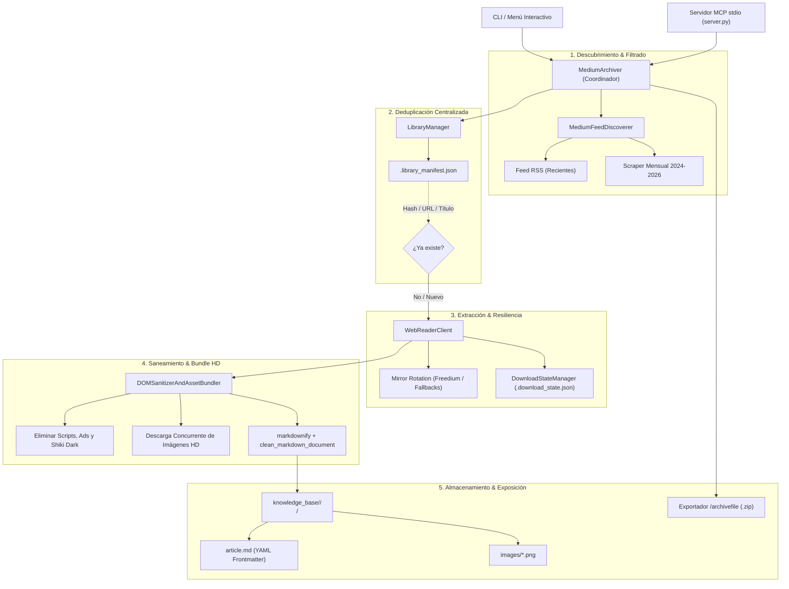

# 📚 Medium Knowledge Base & Bug Bounty Archiver (MCP + Skill Edition)

> **Sistema universal de archivo, deduplicación, auditoría de calidad e indexación offline de artículos de Medium enfocado en Bug Bounty, Pentesting y Ciberseguridad.**  
> Genera documentos Markdown estructurados con metadatos YAML compatibles con **Obsidian**, pipelines de **RAG Local** y **Agentes de IA (Oz, Claude Code, Antigravity, Open Code)**, descargando todas las imágenes e infografías en alta definición (HD).

Incluye integración nativa con el **Model Context Protocol (MCP)** mediante transporte `stdio` y una **Skill universal** para operar de forma transparente en **Antigravity, Claude Code, Gemini CLI, Cursor, Windsurf, Codex y Open Code**.

---

## 📊 Estado Actual de la Base de Conocimiento

| Métrica | Valor Actual |
| :--- | :--- |
| **Total de Artículos Indexados** | **1,275+ writeups únicos** (deduplicados sin redundancia) |
| **Diagramas y Capturas Locales (HD)** | **6,306 imágenes** guardadas localmente |
| **Colecciones / Tópicos Activos** | 11 tópicos (`#bug-bounty`, `#hackerone`, `#client-side path traversal`, `#bugcrowd`, `#intigriti`, `#mass assignment`, `#vdp`, `#hackenproof`, `#llm bug bounty`, `#infosec-writeups`, `#security`) |
| **Espacio Total en Markdown** | **8.58 MB** (texto plano puro optimizado) |
| **Tasa de Defectos Markdown (Encoding / Código)** | **0.0%** (100% auditado y saneado) |

---

## 🌟 Características Principales

### 1. 🔍 Descubrimiento Profundo de Archivo (2024–2026)
Supera la restricción de 10 elementos impuesta por los feeds RSS tradicionales de Medium. Implementa un motor de scraping estático y mensual recursivo (`MediumFeedDiscoverer.fetch_archive_year_articles`) capaz de explorar mes a mes (ej. `/archive/2026/08`, `/archive/2025/11`) para descubrir cientos o miles de artículos históricos y recientes por tag o publicación.

### 2. 🛡️ Deduplicación Inteligente en 3 Niveles
Evita descargas redundantes incluso si un artículo se publica bajo múltiples tags (ej. `#bug-bounty` y `#cybersecurity`) o con URLs distintas:
- **Nivel 1 (Hash del Post):** Extrae el identificador único hexadecimal de Medium (ej. `6059344032d4` de `slug-6059344032d4`).
- **Nivel 2 (URL Canónica Limpia):** Normaliza y elimina parámetros de rastreo (`utm_*`, `source`, `sk`).
- **Nivel 3 (Título Normalizado Fuzzy):** Compara el título en minúsculas sin signos de puntuación contra el índice central `.library_manifest.json`.

### 3. 🧹 Motor de Auditoría y Limpieza de Calidad Markdown (`--audit` / `--clean-markdown`)
Diseñado específicamente para optimizar el consumo de tokens y la precisión de lectura en LLMs y harnesses de IA:
- **Deduplicación de Código Shiki:** Elimina los bloques duplicados idénticos generados por los mirrors de lectura en modo dual (`github-light` y `github-dark`), ahorrando más de **1.4 MB (~350,000 tokens)** de contexto.
- **Inferencia Inteligente de Sintaxis:** Reemplaza etiquetas hardcodeadas por detección automática de lenguaje: `bash` (comandos de terminal, `curl`, `subfinder`, `git`), `http` (peticiones raw `GET/POST`), `json`, `sql`, `javascript`, `python` o texto limpio sin adornos espurios.
- **Reparación Transparente de Mojibake:** Convierte secuencias UTF-8 corrompidas por encabezados `ISO-8859-1` de vuelta a sus caracteres originales (`’`, `—`, `–`, `→`, acentos en español, emojis como `☕`).

### 4. ⚡ Descargas Concurrentes y Alta Resiliencia
- **Pool de Concurrencia:** Descarga artículos e imágenes en paralelo con hasta 10 workers simultáneos vía `ThreadPoolExecutor`.
- **Rotación de Mirrors & Circuit Breaker:** Conmuta automáticamente entre espejos de lectura (`freedium-mirror.cfd`, `freedium.cfd`) aislando temporalmente dominios caídos o con errores DNS/5xx.
- **Checkpointing y Reanudación:** Mantiene el estado en `.download_state.json`, permitiendo pausar con `Ctrl+C` y reanudar la sesión exactamente donde se dejó.

### 5. 📦 Empaquetado Portable (`/archivefile`)
Genera paquetes `.zip` listos para ser transportados a otros entornos, servidores o vaults de Obsidian, comprimiendo tanto los archivos `.md` como las carpetas locales de imágenes en HD.

### 6. 🧠 Grafo de Arquitectura (Graphify)
Mapeo visual del código con análisis AST, dependencias modulares, diagramas de flujo de llamadas y detección de comunidades en `graphify-out/`.

---

## 🏗️ Arquitectura del Sistema



---

## 📁 Estructura del Directorio

```
mediumm/
├── knowledge_base/               # Base de conocimiento categorizada
│   ├── bug-bounty/               # Artículos organizados por título
│   │   └── <Título del Post>/
│   │       ├── article.md        # Markdown limpio con frontmatter YAML
│   │       └── images/           # Diagramas y capturas en resolución HD
│   ├── hackerone/                # Artículos específicos de HackerOne
│   ├── client-side path traversal/# Writeups de CSPT
│   ├── .library_manifest.json    # Índice central (1,275+ entradas)
│   └── exports/                  # Paquetes zip generados (/archivefile)
├── skills/
│   └── medium-knowledge-base/
│       └── SKILL.md              # Definición de Skill para Agentes de IA
├── graphify-out/                 # Visualizaciones y reporte arquitectónico
│   ├── graph.html                # Visualizador interactivo D3
│   ├── GRAPH_TREE.html           # Árbol colapsable interactivo
│   ├── mediumm-callflow.html     # Diagramas de secuencia y flujos
│   └── GRAPH_REPORT.md           # Análisis de comunidades y god-nodes
├── medium_archiver.py            # Motor CLI de descarga, auditoría y deduplicación
├── server.py                     # Servidor MCP stdio universal
├── .mcp.json                     # Especificación de conexión estándar MCP
└── requirements.txt              # Dependencias (requests, bs4, markdownify, rich, mcp)
```

---

## 🚀 Configuración Multi-Harness (MCP)

El servidor MCP [`server.py`](file:///home/max/Projects/Bug-bounty/mediumm/server.py) expone herramientas a través de `stdio`, compatible con todos los clientes y plataformas:

### 1. Claude Code
Añade el servidor ejecutando:
```bash
claude mcp add --transport stdio medium-knowledge-base -- /home/max/Projects/Bug-bounty/mediumm/.venv/bin/python /home/max/Projects/Bug-bounty/mediumm/server.py
```
O coloca en el archivo `.mcp.json` de tu proyecto:
```json
{
  "mcpServers": {
    "medium-knowledge-base": {
      "command": "/home/max/Projects/Bug-bounty/mediumm/.venv/bin/python",
      "args": ["/home/max/Projects/Bug-bounty/mediumm/server.py"],
      "env": {
        "PYTHONUNBUFFERED": "1"
      }
    }
  }
}
```

### 2. Google Antigravity & Gemini CLI
Configurado en `~/.gemini/config/mcp_config.json`:
```json
"medium-knowledge-base": {
  "command": "/home/max/Projects/Bug-bounty/mediumm/.venv/bin/python",
  "args": ["/home/max/Projects/Bug-bounty/mediumm/server.py"],
  "env": {
    "PYTHONUNBUFFERED": "1",
    "MEDIUM_KNOWLEDGE_BASE": "/home/max/Projects/Bug-bounty/mediumm/knowledge_base"
  }
}
```

### 3. Cursor & Windsurf
En `~/.config/Cursor/User/globalStorage/cursor.mcp.json` o `.cursor/mcp.json`:
```json
{
  "mcpServers": {
    "medium-knowledge-base": {
      "command": "/home/max/Projects/Bug-bounty/mediumm/.venv/bin/python",
      "args": ["/home/max/Projects/Bug-bounty/mediumm/server.py"]
    }
  }
}
```

---

## 🛠️ Herramientas MCP Disponibles

| Herramienta MCP | Descripción | Argumentos |
| :--- | :--- | :--- |
| `medium_search_articles` | Búsqueda instantánea offline por título, autor, CVE, payload o texto del cuerpo. | `query` (str), `topic` (str, opcional), `limit` (int) |
| `medium_get_article` | Devuelve el contenido íntegro en Markdown, frontmatter YAML y bloques de código. | `identifier` (hash de Medium, título o ruta) |
| `medium_get_stats` | Métricas en tiempo real (artículos indexados, imágenes HD, megabytes en disco). | *(Ninguno)* |
| `medium_archive_url` | Descarga, sanea y cataloga una URL individual de Medium bajo demanda. | `url` (str), `topic` (str, default: 'bug-bounty') |
| `medium_export_archive` | Genera un archivo `.zip` comprimido de la base completa o de un tópico específico. | `topic` (str, opcional), `output_zip_path` (str, opcional) |

---

## 💻 Uso desde la Línea de Comandos (CLI)

```bash
# 1. Búsqueda instantánea en tu biblioteca offline
python3 medium_archiver.py --search "IDOR"
python3 medium_archiver.py --search "SSRF"
python3 medium_archiver.py --search "Client-Side Path Traversal"

# 2. Ver estadísticas y salud de la biblioteca
python3 medium_archiver.py --stats

# 3. Auditar calidad y legibilidad Markdown para LLMs (modo solo-lectura)
python3 medium_archiver.py --audit

# 4. Limpiar y reparar en lote todos los artículos (deduplicación Shiki + UTF-8 + sintaxis)
python3 medium_archiver.py --clean-markdown

# 5. Descubrir y listar artículos sin descargar (modo seguro)
python3 medium_archiver.py --tag bug-bounty --list-only

# 6. Descargar artículos nuevos en paralelo (con 6 workers y confirmación automática)
python3 medium_archiver.py --tag bug-bounty -c 6 -y

# 7. Descubrir con rango de años específico
python3 medium_archiver.py --tag bug-bounty --from-year 2025 --to-year 2026 -c 6 -y

# 8. Generar paquete comprimido (.zip) de la base de conocimiento (/archivefile)
python3 medium_archiver.py --archive-file

# 9. Empaquetar solo un tema específico
python3 medium_archiver.py --tag bug-bounty --archive-file /tmp/bug-bounty-knowledge.zip
```

---

## 🔬 Flujo de Trabajo en Bug Bounty (Research Workflow)

Cuando te enfrentes a un objetivo autorizado (HackerOne, Bugcrowd, YesWeHack, Intigriti):

```
1. Reconocimiento de Superficie
   │
   ├─ Se identifica tecnología o endpoint: ej. "GraphQL /graphql" o "Next.js Server Actions"
   │
   ▼
2. Consulta Local sin Latencia (0 peticiones a internet)
   │
   ├─ Ejecutar `medium_search_articles(query="Next.js Server Actions", limit=5)`
   ├─ Analizar títulos, autores y fragmentos clave devueltos
   │
   ▼
3. Recuperación del Writeup Detallado
   │
   ├─ Ejecutar `medium_get_article(identifier="<hash_del_post>")`
   ├─ Extraer la estructura exacta de requests HTTP, nombres de parámetros y payloads
   │
   ▼
4. Adaptación y Explotación Ética
   │
   ├─ Probar en el alcance autorizado adaptando las variables observadas
   └─ Redactar el reporte de impacto citando la metodología de referencia
```

---

## 🧠 Integración con Graphify

El código está completamente analizado con `graphify` para auditar la salud arquitectónica:

- **Grafo interactivo en navegador:** Abre [`graphify-out/graph.html`](file:///home/max/Projects/Bug-bounty/mediumm/graphify-out/graph.html) para explorar relaciones visuales entre módulos.
- **Árbol colapsable interactivo:** Abre [`graphify-out/GRAPH_TREE.html`](file:///home/max/Projects/Bug-bounty/mediumm/graphify-out/GRAPH_TREE.html) para navegar la jerarquía de funciones y clases.
- **Flujos de llamadas:** Abre [`graphify-out/mediumm-callflow.html`](file:///home/max/Projects/Bug-bounty/mediumm/graphify-out/mediumm-callflow.html) para inspeccionar diagramas de secuencia e interacciones.
- **Reporte arquitectónico:** Consulta [`graphify-out/GRAPH_REPORT.md`](file:///home/max/Projects/Bug-bounty/mediumm/graphify-out/GRAPH_REPORT.md) para métricas de centralidad, hubs y comunidades identificadas.

Para regenerar o actualizar el análisis tras modificaciones en el código:
```bash
graphify extract mediumm --code-only
graphify cluster-only mediumm
graphify tree --graph mediumm/graphify-out/graph.json --output mediumm/graphify-out/GRAPH_TREE.html
```

---

## 🧪 Suite de Pruebas Automatizadas

El repositorio cuenta con una suite completa de pruebas unitarias y de integración bajo `pytest`:

```bash
# Ejecutar toda la batería de pruebas
pytest tests/ -v

# Ejecutar módulos específicos
pytest tests/test_mcp_server.py -v
pytest tests/test_sanitizer.py -v
pytest tests/test_metadata.py -v
pytest tests/test_library.py -v
```

Las pruebas cubren:
- **Sanitización & Encoding:** Slugs normalizados, remoción de caracteres no seguros para filesystem en Win/Linux/macOS y reparación de mojibake UTF-8.
- **Extracción de Metadatos:** Extracción de hashes de posts Medium en URLs de subdominios, perfiles y limpieza de parámetros de telemetría (`utm_*`, `source`, `ref`, `gi`).
- **Gestión de Biblioteca:** Persistencia y sincronización del índice central `.library_manifest.json`, deduplicación de artículos y verificación cruzada.
- **Herramientas MCP:** Integración funcional de todas las herramientas (`medium_search_articles`, `medium_get_article`, `medium_get_stats`, `medium_export_archive`).

La suite se ejecuta automáticamente en GitHub Actions en matrices de Python 3.10, 3.11, 3.12 y 3.13.

---

## 📄 Licencia

Distribuido bajo la Licencia MIT. Consulta [`LICENSE`](LICENSE) para más información.

