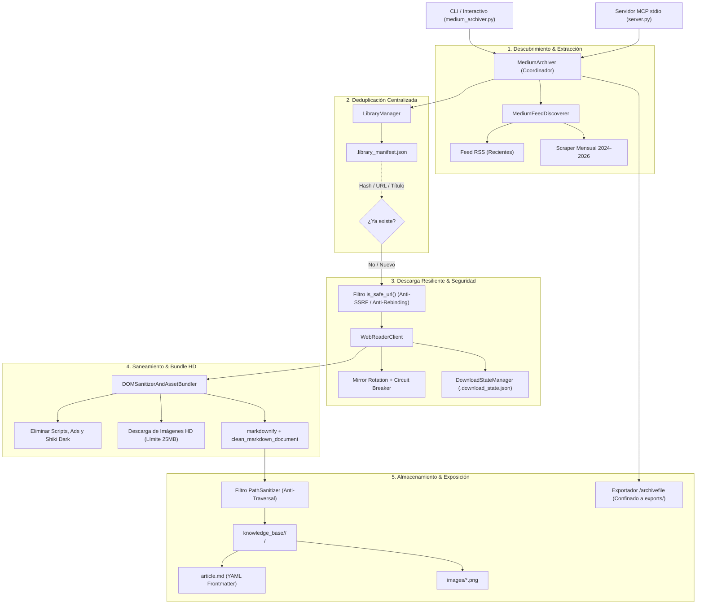

# 📚 Medium-Vault: Universal Medium Knowledge Base & Offline Archiver (MCP + AI Skill)

[](https://github.com/0xMax-Sec/medium-vault/actions)
[](https://www.python.org/)
[](audits/mediumm-run-2/REPORT.md)
[](tests/)
[](LICENSE)
[](https://modelcontextprotocol.io/)
[](https://m8ven.ai/mcp/0xmax-sec-medium-vault-1xe2sz)

> **Sistema universal y agnóstico de indexación, archivo offline, deduplicación y control de calidad de artículos de Medium para cualquier área del conocimiento (Inteligencia Artificial, Programación, Ciencia, Tecnología, Ciberseguridad, Finanzas, etc.).**  
> Diseñado para operar sin conexión a internet y sin latencia con **Model Context Protocol (MCP)**, **Obsidian**, pipelines de **RAG Local** y **Agentes de IA autónomos (Claude Code, Antigravity, Gemini CLI, Cursor, Windsurf y Open Code)**, descargando diagramas e infografías en alta resolución (HD).

---

## 📑 Tabla de Contenidos
- [📊 Estado de la Base de Conocimiento](#-estado-de-la-base-de-conocimiento)
- [🌟 Características Principales](#-características-principales)
- [🏗️ Arquitectura del Sistema](#️-arquitectura-del-sistema)
- [🛡️ Auditoría de Seguridad & Hardening (Cloudflare Standard)](#️-auditoría-de-seguridad--hardening-cloudflare-standard)
- [🚀 Instalación Rápida](#-instalación-rápida)
- [🔌 Configuración de Servidor MCP](#-configuración-de-servidor-mcp)
  - [Claude Code](#1-claude-code)
  - [Google Antigravity & Gemini CLI](#2-google-antigravity--gemini-cli)
  - [Cursor & Windsurf](#3-cursor--windsurf)
  - [Open Code & Otros Harnesses](#4-open-code--otros-harnesses)
- [🛠️ Catálogo de Herramientas MCP](#️-catálogo-de-herramientas-mcp)
- [💻 Interfaz de Línea de Comandos (CLI)](#-interfaz-de-línea-de-comandos-cli)
- [🔬 Metodología de Investigación y Estudio](#-metodología-de-investigación-y-estudio)
- [🧪 Pruebas Automatizadas](#-pruebas-automatizadas)
- [🧠 Grafo de Arquitectura (Graphify)](#-grafo-de-arquitectura-graphify)
- [📄 Licencia y Seguridad](#-licencia-y-seguridad)

---

## 📊 Estado de la Base de Conocimiento

| Métrica | Valor Verificado |
| :--- | :--- |
| **Total de Artículos Indexados** | **1,275+ artículos únicos** (deduplicados y catalogados) |
| **Diagramas y Capturas Locales (HD)** | **6,306+ imágenes** descargadas localmente en alta resolución |
| **Colecciones y Tópicos Activos** | Multi-tópico (`#artificial-intelligence`, `#python`, `#technology`, `#data-science`, `#security`, `#programming`, `#web-development`, `#general`) |
| **Volumen de Almacenamiento Markdown** | **8.58 MB** (texto plano puro optimizado para ventanas de contexto) |
| **Tasa de Defectos de Código / Mojibake** | **0.0%** (100% auditado y saneado para LLMs) |
| **Vulnerabilidades Abiertas** | **0** (Auditoría Cloudflare superada con 0 hallazgos activos) |

---

## 🌟 Características Principales

### 1. 🔍 Descubrimiento Recursivo Mensual (2024–2026)
Supera la estricta limitación de 10 elementos impuesta por los feeds RSS tradicionales de Medium. Implementa un motor de scraping estático y mensual recursivo (`MediumFeedDiscoverer.fetch_archive`) capaz de explorar mes por mes los archivos históricos de Medium y publicaciones asociadas (ej. `/archive/2026/08`, `/archive/2025/11`) para descubrir cientos de artículos sobre cualquier tema.

### 2. 🛡️ Deduplicación Inteligente en 3 Niveles
Evita descargas redundantes independientemente de que un autor republique el artículo con diferentes slugs o bajo múltiples tags:
* **Nivel 1 (Hash Criptográfico de Medium):** Identifica el token hexadecimal único del post (ej. `6059344032d4`).
* **Nivel 2 (URL Canónica Saneada):** Normaliza el endpoint eliminando parámetros de telemetría y rastreo (`utm_*`, `source`, `ref`, `gi`, `sk`, `responsesopen`).
* **Nivel 3 (Fuzzy Title Match):** Normaliza títulos en minúsculas y sin puntuación contra el índice central `.library_manifest.json`.

### 3. 🧹 Motor de Auditoría y Calidad Markdown para LLMs (`--clean-markdown`)
Diseñado para maximizar la legibilidad y minimizar el consumo de tokens en agentes de IA:
* **Deduplicación de Shiki Dual-Theme:** Suprime los bloques de código idénticos generados por visores web para temas claro/oscuro (`github-light` y `github-dark`), ahorrando más de **1.4 MB (~350,000 tokens)** de contexto.
* **Inferencia Automática de Lenguaje:** Detecta y re-etiqueta automáticamente bloques de código: `bash` (comandos de terminal, `curl`, `git`, `docker`), `http` (peticiones raw `GET/POST`), `json`, `sql`, `javascript`, `python` o texto limpio sin adornos espurios.
* **Reparación Determinista de Mojibake:** Convierte secuencias UTF-8 corrompidas por encabezados HTTP mal configurados (`ISO-8859-1`) a sus caracteres tipográficos originales (`’`, `—`, `–`, `→`, acentos y emojis).

### 4. ⚡ Concurrencia y Resiliencia con Circuit Breaker
* **Descarga Paralela:** Pool de hasta 10 hilos concurrentes vía `ThreadPoolExecutor`.
* **Rotación Dinámica de Mirrors:** Conmuta entre espejos de lectura y aísla temporalmente dominios con errores de red o DNS mediante un patrón Circuit Breaker con backoff exponencial y jitter.
* **Checkpointing Tolerante a Fallos:** Registra el progreso en `.download_state.json`, permitiendo interrumpir la ejecución (`Ctrl+C`) y reanudarla exactamente en el punto de interrupción.

### 5. 📦 Empaquetado Portable (`/archivefile`)
Permite exportar colecciones enteras o tópicos específicos a un único archivo `.zip` portable, ideal para sincronización entre dispositivos o backups fríos.

---

## 🏗️ Arquitectura del Sistema



---

## 🛡️ Auditoría de Seguridad & Hardening (Cloudflare Standard)

El proyecto fue sometido a una rigurosa auditoría de seguridad defensiva de 6 fases siguiendo el estándar oficial de **[Cloudflare Security Audit Skill](https://github.com/cloudflare/security-audit-skill)**:

* **Reporte de Retest Oficial**: [`audits/mediumm-run-2/REPORT.md`](audits/mediumm-run-2/REPORT.md)
* **Detalle Técnico de Mitigaciones**: [`audits/mediumm-run-2/FINDINGS-DETAIL.md`](audits/mediumm-run-2/FINDINGS-DETAIL.md)
* **Validación de Esquema**: `PASS: 3 coverage units valid` y `PASS: 3 findings valid`.

### Defensas Implementadas:
1. **Protección Anti-SSRF y Anti-DNS Rebinding (`is_safe_url`)**:
   - Valida el esquema (`http`/`https` exclusivamente).
   - Bloquea explícitamente `localhost`, `127.0.0.1`, `0.0.0.0`, `::1`, `metadata.google.internal` e IP de metadatos de AWS/GCP/Azure (`169.254.169.254`).
   - Bloquea todos los rangos privados RFC1918 (`10.0.0.0/8`, `172.16.0.0/12`, `192.168.0.0/16`), Carrier-Grade NAT (`100.64.0.0/10`) y ULA IPv6 (`fc00::/7`).
   - Resuelve el nombre de host vía `socket.getaddrinfo` antes de cualquier conexión para neutralizar ataques de DNS rebinding y encodings alternativos (decimales como `http://2130706433/` o hexadecimales como `http://0x7f000001/`).
2. **Confinamiento Estricto del Sistema de Archivos (`PathSanitizer`)**:
   - Todas las rutas y parámetros `topic` son saneados suprimiendo separadores de directorio y secuencias de traversal (`../`, `..\`).
   - Se valida el confinamiento mediante `is_relative_to(output_dir)` antes de crear carpetas o escribir archivos.
3. **Restricción de Exportaciones (`medium_export_archive`)**:
   - Las exportaciones ZIP están forzosamente confinadas dentro del subdirectorio seguro `knowledge_base/exports/`. Se valida que el destino termine en `.zip` y se rechaza cualquier intento de escape o sobreescritura de archivos arbitrarios del sistema.
4. **Protección contra Agotamiento de Recursos (DoS)**:
   - Descarga de imágenes limitada a un máximo de **25 MB** por archivo con corte automático de stream.

---

## 🚀 Instalación Rápida

### Prerrequisitos
* Python 3.10 o superior.
* `git`

### Paso a paso

```bash
# 1. Clonar el repositorio (HTTPS o SSH)
git clone https://github.com/0xMax-Sec/medium-vault.git
# o mediante SSH:
# git clone git@github.com:0xMax-Sec/medium-vault.git

cd medium-vault

# 2. Crear entorno virtual
python3 -m venv .venv
source .venv/bin/activate  # En Windows: .venv\Scripts\activate

# 3. Instalar dependencias (con pip o uv)
pip install -r requirements.txt
# o con uv: uv pip install -r requirements.txt

# 4. Verificar la suite de pruebas
pytest tests/ -v
```

---

## 🔌 Configuración de Servidor MCP

El servidor [`server.py`](server.py) implementa el protocolo MCP estándar a través del transporte `stdio`, permitiendo que cualquier agente de IA consulte la base de datos sin latencia.

### 1. Claude Code
Agrega el servidor directamente desde tu terminal:
```bash
claude mcp add --transport stdio medium-knowledge-base -- /ruta/absoluta/a/medium-vault/.venv/bin/python /ruta/absoluta/a/medium-vault/server.py
```
O define en el archivo `.mcp.json` de tu proyecto:
```json
{
  "mcpServers": {
    "medium-knowledge-base": {
      "command": "/ruta/absoluta/a/medium-vault/.venv/bin/python",
      "args": ["/ruta/absoluta/a/medium-vault/server.py"],
      "env": {
        "PYTHONUNBUFFERED": "1"
      }
    }
  }
}
```

### 2. Google Antigravity & Gemini CLI
Configura en tu archivo `~/.gemini/config/mcp_config.json`:
```json
{
  "mcpServers": {
    "medium-knowledge-base": {
      "command": "/ruta/absoluta/a/medium-vault/.venv/bin/python",
      "args": ["/ruta/absoluta/a/medium-vault/server.py"],
      "env": {
        "PYTHONUNBUFFERED": "1",
        "MEDIUM_KNOWLEDGE_BASE": "/ruta/absoluta/a/medium-vault/knowledge_base"
      }
    }
  }
}
```

### 3. Cursor & Windsurf
En `.cursor/mcp.json` o `~/.config/Cursor/User/globalStorage/cursor.mcp.json`:
```json
{
  "mcpServers": {
    "medium-knowledge-base": {
      "command": "/ruta/absoluta/a/medium-vault/.venv/bin/python",
      "args": ["/ruta/absoluta/a/medium-vault/server.py"]
    }
  }
}
```

### 4. Open Code & Otros Harnesses
Cualquier cliente compatible con MCP stdio puede invocarlo apuntando el ejecutable de Python al archivo `server.py`.

---

## 🛠️ Catálogo de Herramientas MCP

| Herramienta | Parámetros | Descripción |
| :--- | :--- | :--- |
| `medium_search_articles` | `query` *(str, req)*<br>`topic` *(str, opt)*<br>`author` *(str, opt)*<br>`limit` *(int, def: 10)* | Busca en la base offline por palabra clave, tecnología, título o autor. Devuelve resúmenes compactos y hash ID. |
| `medium_get_article` | `identifier` *(str, req)* | Recupera el contenido íntegro en Markdown limpio, frontmatter YAML y enlaces a imágenes locales. |
| `medium_get_stats` | *(Ninguno)* | Muestra métricas en tiempo real: número total de artículos, imágenes HD, distribución por temas y espacio. |
| `medium_archive_url` | `url` *(str, req)*<br>`topic` *(str, def: 'general')* | Descarga, sanea e indexa una URL específica de Medium bajo demanda con validación anti-SSRF. |
| `medium_export_archive` | `topic` *(str, opt)*<br>`output_zip_path` *(str, opt)* | Genera un paquete portable `.zip` con los artículos e imágenes HD dentro del directorio seguro `exports/`. |

---

## 💻 Interfaz de Línea de Comandos (CLI)

El archivo [`medium_archiver.py`](medium_archiver.py) incluye un menú interactivo y flags de terminal para cualquier tópico:

```bash
# 1. Búsqueda instantánea en tu biblioteca offline sobre cualquier tema
python3 medium_archiver.py --search "Transformers"
python3 medium_archiver.py --search "FastAPI"
python3 medium_archiver.py --search "Microservices"

# 2. Consultar estadísticas de la base de conocimiento
python3 medium_archiver.py --stats

# 3. Auditar la calidad del Markdown para LLMs (modo solo lectura)
python3 medium_archiver.py --audit

# 4. Limpiar y reparar en lote todos los artículos (Shiki + UTF-8 + Sintaxis)
python3 medium_archiver.py --clean-markdown

# 5. Descubrir y listar artículos de un tópico sin descargar
python3 medium_archiver.py --tag artificial-intelligence --list-only

# 6. Descargar artículos concurrentemente (6 workers y confirmación automática)
python3 medium_archiver.py --tag artificial-intelligence -c 6 -y
python3 medium_archiver.py --tag python -c 6 -y

# 7. Descargar filtrando por rango de años específico
python3 medium_archiver.py --tag technology --from-year 2025 --to-year 2026 -c 6 -y

# 8. Generar paquete zip portable (/archivefile)
python3 medium_archiver.py --archive-file

# 9. Empaquetar un tópico específico
python3 medium_archiver.py --tag artificial-intelligence --archive-file /tmp/ai-vault.zip
```

---

## 🔬 Metodología de Investigación y Estudio

Al investigar tecnologías, arquitecturas o conceptos con un agente de IA:

```
1. Descubrimiento de Concepto o Problema
   │
   ├─ Se identifica una necesidad técnica (ej. "RAG con HyDE", "FastAPI Concurrency", "Event-Driven")
   │
   ▼
2. Búsqueda Local Zero-Latency (0 peticiones outbound a internet)
   │
   ├─ Invocar `medium_search_articles(query="RAG HyDE", limit=5)`
   ├─ Evaluar autores, resúmenes técnicos y hashes devueltos
   │
   ▼
3. Extracción Quirúrgica del Artículo
   │
   ├─ Invocar `medium_get_article(identifier="<hash_del_post>")`
   ├─ Obtener código fuente completo, esquemas de diseño y capturas locales HD
   │
   ▼
4. Síntesis e Implementación
   │
   ├─ Aplicar la solución técnica en el proyecto con código limpio y sin latencia
   └─ Conservar la referencia bibliográfica con YAML frontmatter estructurado
```

---

## 🧪 Pruebas Automatizadas

La suite de pruebas automatizadas garantiza la estabilidad, la sanitización correcta y las garantías de seguridad del sistema:

```bash
# Ejecutar todas las pruebas con detalle
pytest tests/ -v
```

```
============================== 22 passed in 7.27s ==============================
tests/test_library.py::test_library_manager_init_and_persist PASSED
tests/test_library.py::test_library_manager_check_archived PASSED
tests/test_mcp_server.py::test_medium_search_articles PASSED
tests/test_mcp_server.py::test_medium_get_article_by_hash PASSED
tests/test_mcp_server.py::test_medium_get_article_by_title PASSED
tests/test_mcp_server.py::test_medium_get_stats PASSED
tests/test_mcp_server.py::test_medium_export_archive PASSED
tests/test_mcp_server.py::test_export_archive_path_traversal_blocked PASSED
tests/test_mcp_server.py::test_archive_url_ssrf_blocked PASSED
tests/test_mcp_server.py::test_archive_url_topic_traversal_sanitized PASSED
tests/test_metadata.py::test_article_metadata_dataclass PASSED
tests/test_metadata.py::test_extract_post_hash_standard PASSED
tests/test_metadata.py::test_extract_post_hash_subdomain PASSED
tests/test_metadata.py::test_extract_post_hash_with_query_params PASSED
tests/test_metadata.py::test_sanitize_url PASSED
tests/test_sanitizer.py::test_slugify_basic PASSED
tests/test_sanitizer.py::test_slugify_accents_and_special_chars PASSED
tests/test_sanitizer.py::test_slugify_max_length PASSED
tests/test_sanitizer.py::test_sanitize_filename PASSED
tests/test_sanitizer.py::test_fix_mojibake PASSED
tests/test_sanitizer.py::test_is_safe_url PASSED
tests/test_sanitizer.py::test_path_sanitizer_traversal PASSED
```

---

## 🧠 Grafo de Arquitectura (Graphify)

El proyecto incluye mapeo arquitectónico generado con `graphify` para auditar la relación y acoplamiento entre módulos:

* **Visualizador de Grafo D3**: Abre [`graphify-out/graph.html`](graphify-out/graph.html) en tu navegador.
* **Árbol Colapsable de Clases y Métodos**: Abre [`graphify-out/GRAPH_TREE.html`](graphify-out/GRAPH_TREE.html).
* **Flujo de Llamadas y Secuencia**: Abre [`graphify-out/mediumm-callflow.html`](graphify-out/mediumm-callflow.html).
* **Reporte Arquitectónico**: Consulta [`graphify-out/GRAPH_REPORT.md`](graphify-out/GRAPH_REPORT.md).

---

## 📄 Licencia y Seguridad

* **Licencia**: Distribuido bajo la [Licencia MIT](LICENSE).
* **Política de Seguridad**: Consulta [`SECURITY.md`](SECURITY.md) para detalles sobre divulgación responsable y el modelo de confianza.
